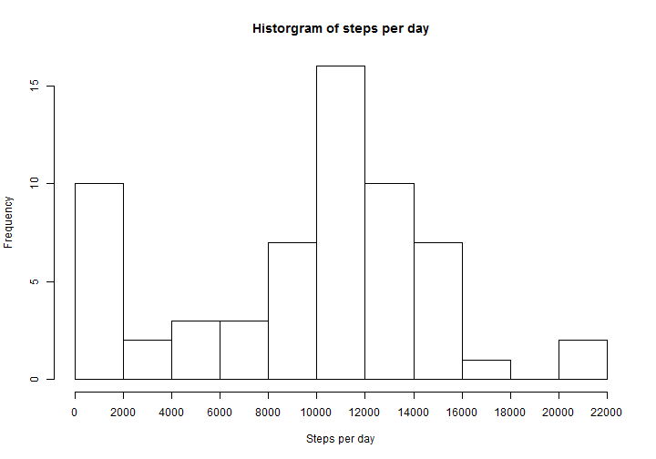
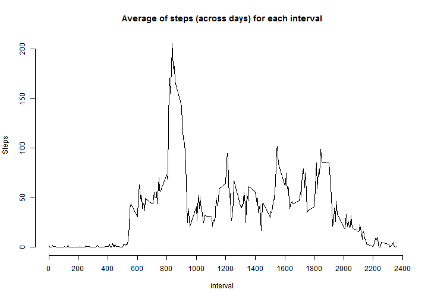
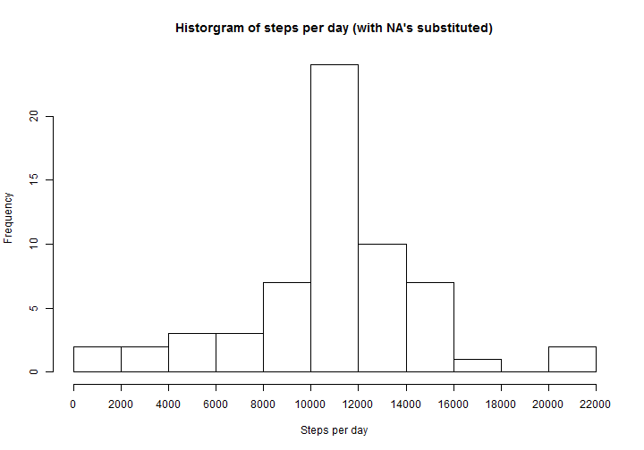
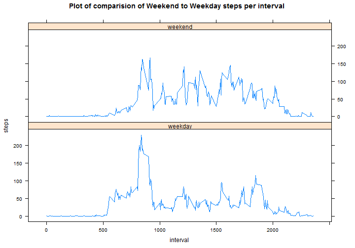

## Loading and preprocessing the data

```r
if(!file.exists("activity.csv")) {
    file.url<-"http://d396qusza40orc.cloudfront.net/repdata%2Fdata%2Factivity.zip"
    download.file(file.url,"activity.zip",mode="wb",method="auto")
    unzip("activity.zip")
}
activity<-read.csv("activity.csv",header=TRUE,stringsAsFactors=FALSE)
activity$date<-as.Date(activity$date)
```

## What is mean total number of steps taken per day?

```r
steps.by.date<-tapply(activity$steps,activity$date,sum, na.rm=TRUE)
hist(steps.by.date,breaks=10,main="Historgram of steps per day",xlab="Steps per day",axes=F)
axis(2)
axis(1,at=seq(0,22000, by=2000))
```

 

Mean of Total steps per day

```r
mean(steps.by.date,na.rm=TRUE)
```

```
## [1] 9354.23
```

Median of Total steps per day

```r
median(steps.by.date,na.rm=TRUE)
```

```
## [1] 10395
```


## What is the average daily activity pattern?

```r
steps.by.interval<-round(tapply(activity$steps,activity$interval,mean, na.rm=TRUE))
interval<-as.numeric(row.names(steps.by.interval))
plot(steps.by.interval ~ interval, type="l", main="Average of steps (across days) for each interval",ylab="Steps", axes=FALSE)
axis(2)
axis(1, at=seq(0,2400, by=200))
```

 

The interval with the maximum number of steps (averaged per day) is

```r
interval[which.max(steps.by.interval)]
```

```
## [1] 835
```
## Imputing missing values
The number of missing values is:

```r
sum(is.na(activity$steps))
```

```
## [1] 2304
```


```r
#Create new array with NA's repalced with mean by matching interval
activity2<-activity
steps2.by.interval<-round(tapply(activity2$steps,activity2$interval,mean))
activity2$steps<-mapply(function(steps,interval) ifelse(is.na(steps),steps.by.interval[as.character(interval)],steps),steps=activity2$steps,interval=activity2$interval)
steps2.by.date<-tapply(activity2$steps,activity2$date,sum)
```


```r
#Create comparitive histogram
hist(steps2.by.date,breaks=10,main="Historgram of steps per day (with NA's substituted)",xlab="Steps per day",axes=F)
axis(2)
axis(1,at=seq(0,22000, by=2000))
```

 

Mean of Total steps per day

```r
mean(steps2.by.date,na.rm=TRUE)
```

```
## [1] 10765.64
```

Median of Total steps per day

```r
median(steps2.by.date,na.rm=TRUE)
```

```
## [1] 10762
```
It can be inferred that the mean and median values have moved slightly higher due to the NA's effectively counting as 0's previously and weighting the overall distribution lower. This can also be seen by the much lower 0-1000 steps per day which was artifically increased by NA's counting as 0's


## Are there differences in activity patterns between weekdays and weekends?

```r
#create factor variable
activity2$Weekday<-as.factor(mapply(function(date) ifelse(weekdays(date)=="Sunday"||weekdays(date)=="Saturday","weekend","weekday"),date=activity2$date))

# create new data frame for easier plotting
library(reshape2)
steps3.by.interval<-as.data.frame(round(tapply(activity2$steps,list(activity2$interval,activity2$Weekday),mean)))
steps3.by.interval$interval<-as.numeric(row.names(steps3.by.interval))
steps3.by.interval<-melt(steps3.by.interval,id="interval",value.name="steps",variable.name="Weekday")

#create panel plot
library(lattice)
xyplot(steps ~ interval|Weekday,data=steps3.by.interval,type="l", layout=c(1,2))
```

 

